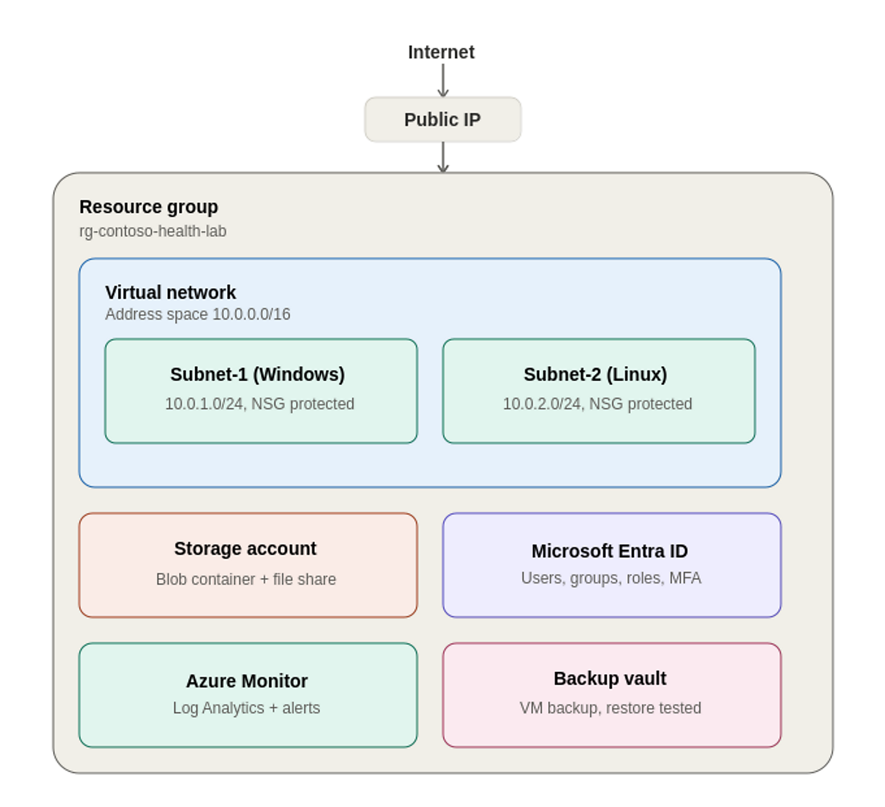

# Contoso Health – Azure Cloud Support Engineering Home Lab

## 📌 Overview

This project simulates a real-world Azure environment for a company with
50 employees. The goal is to build, secure, monitor, and troubleshoot
cloud resources as a Cloud Support Engineer.

## 💻 Environment Architecture

- **Resource Group:** `rg-contoso-health-lab`
- **Virtual Network:** `vnet-contoso-health` (10.0.0.0/16)
  - **Subnet-1** `snet-servers-windows` (10.0.1.0/24) — Windows Server 2022 VM, protected by `nsg-windows-subnet`
  - **Subnet-2** `snet-servers-linux` (10.0.2.0/24) — Ubuntu 24.04 VM, protected by `nsg-linux-subnet`
- **Storage Account:** Blob container + File share, network-restricted
- **Microsoft Entra ID:** Users, security group, RBAC role assignment, MFA via Security Defaults
- **Azure Monitor + Log Analytics:** VM Insights connected, custom high-CPU alert rule
- **Azure Backup Vault:** Daily backup policy, on-demand backup, and a full VM restore test

## ✅ What I Built

- Deployed a secure Azure network with NSGs and subnets, restricted to admin-only source IPs
- Provisioned Windows and Linux virtual machines and connected to each via RDP and SSH
- Configured storage accounts (Blob + File Share) with private access and network restrictions
- Implemented Microsoft Entra ID users, a security group, RBAC role assignment, and MFA
- Enabled monitoring with Azure Monitor and Log Analytics, including a live CPU alert rule
- Configured Azure Backup and successfully restored a VM from a recovery point
- Automated deployments using PowerShell, Azure CLI, and Bicep — all three validated end to end
- Diagnosed and resolved real deployment issues (see Troubleshooting below), not just simulated ones

## 🛠️ Technologies Used

Azure Virtual Network, Network Security Groups, Virtual Machines,
Storage Accounts, Microsoft Entra ID, Azure Monitor, Log Analytics,
Azure Backup, PowerShell, Azure CLI, Bicep, GitHub

## 🧭 Lab Walkthrough

1. [Networking](screenshots/1-networking)
2. [Virtual Machines](screenshots/2-vms)
3. [Storage](screenshots/3-storage)
4. [Identity](screenshots/4-identity)
5. [Monitoring](screenshots/5-monitoring)
6. [Backup](screenshots/6-backup)
7. [Troubleshooting](troubleshooting)

## ⚙️ Automation

All three deployment methods were built and tested against the same environment:

- [`powershell/deploy-lab.ps1`](powershell/deploy-lab.ps1) — PowerShell (Az module) deployment script
- [`azure-cli/deploy-lab.sh`](azure-cli/deploy-lab.sh) — Azure CLI (Bash) deployment script
- [`azure-resources.bicep`](azure-resources.bicep) — Infrastructure as Code template, deployed with `az deployment group create`

## 🧠 Lessons Learned

Building this lab surfaced real infrastructure problems, not just textbook ones. Re-running
deployment scripts against resources that already had live VMs attached triggered an
`InUseSubnetCannotBeDeleted` error — a good reminder that Azure protects in-use subnets from
being redefined, and that automation scripts need to account for resources that already exist
rather than assuming a clean slate every run. I also worked through a Windows PowerShell execution
policy block and an Azure CLI Windows authentication broker issue, both common friction points when
setting up a new machine for cloud administration. Each issue is documented in the
[troubleshooting](troubleshooting) folder with the symptom, investigation, root cause, and fix.

## 📸 Screenshots

See the [screenshots](screenshots) folder for visual proof of every component above.

## 🚀 How to Use This Lab

1. Clone this repo
2. Install Azure CLI and the PowerShell Az module
3. Run `az login` or `Connect-AzAccount`
4. Deploy with any of the three methods:
   - `./powershell/deploy-lab.ps1`
   - `./azure-cli/deploy-lab.sh`
   - `az deployment group create --resource-group rg-contoso-health-lab --template-file azure-resources.bicep`

## 📄 License

This project is licensed under the MIT License — see [LICENSE](LICENSE).
