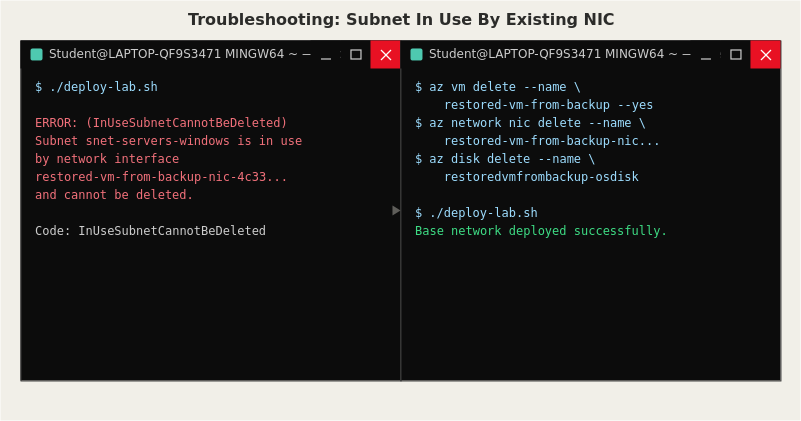

# Issue: Subnet In Use By Existing Network Interface



## Symptom
Running the Azure CLI deployment script (`azure-cli/deploy-lab.sh`) failed partway
through with the following error:

```
ERROR: (InUseSubnetCannotBeDeleted) Subnet snet-servers-windows is in use by
/subscriptions/.../networkInterfaces/restored-vm-from-backup-nic-4c33561c3ab84fa3a40598257aa13f15/ipConfigurations/ipconfig1
and cannot be deleted. In order to delete the subnet, delete all the resources
within the subnet.
```

The script's virtual network deployment step attempts to fully redefine the VNet
and its subnets on every run, but Azure refused to let it touch a subnet that had
an active resource still connected to it.

## Investigation
Ran `az network nic list --resource-group rg-contoso-health-lab --output table`
to see what was actually attached to the subnet. This revealed a network interface
called `restored-vm-from-backup-nic-...`, which traced back to a VM named
`restored-vm-from-backup`. That VM was a leftover from an earlier Azure Backup
restore test (Step 9 of the build) — it had never been cleaned up after I confirmed
the restore worked.

## Root Cause
The Azure CLI deployment script assumes it is deploying into a clean subnet, but
a leftover test VM (with its NIC and OS disk) was still occupying an IP in that
subnet. Azure correctly blocked the subnet from being redefined while a live
resource depended on it.

## Fix
Removed the orphaned resources in the correct order using Azure CLI:

```bash
az vm delete --resource-group rg-contoso-health-lab \
  --name restored-vm-from-backup --yes

az network nic delete --resource-group rg-contoso-health-lab \
  --name restored-vm-from-backup-nic-4c33561c3ab84fa3a40598257aa13f15

az disk delete --resource-group rg-contoso-health-lab \
  --name restoredvmfrombackup-osdisk-20260804-015556 --yes
```

Re-ran `./deploy-lab.sh` afterward and it completed successfully with no errors.

## Prevention
Any time a resource is spun up purely to test a feature (like a backup restore),
it should be deleted immediately after validation — not left running. This is now
part of my personal checklist after any restore test, and it's a good example of
why deployment scripts should ideally check whether resources already exist before
trying to redefine them (idempotent deployment design).
