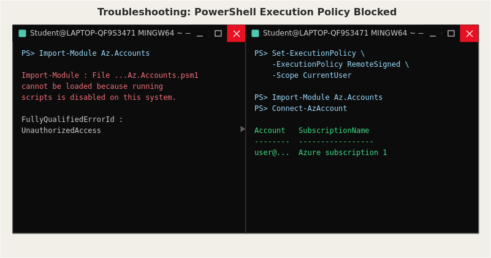

# Issue: PowerShell Blocked From Loading the Az Module



## Symptom
After installing the Az PowerShell module, running `Connect-AzAccount` failed with:

```
Connect-AzAccount : The 'Connect-AzAccount' command was found in the module
'Az.Accounts', but the module could not be loaded.
```

Manually trying to load the module directly produced a clearer error:

```
Import-Module : File ...\Az.Accounts.psm1 cannot be loaded because running
scripts is disabled on this system.
FullyQualifiedErrorId : UnauthorizedAccess
```

## Investigation
The error message pointed directly at PowerShell's script execution policy — a
Windows security feature that blocks PowerShell scripts (`.ps1`, `.psm1` files)
from running by default, to prevent malicious scripts from executing silently.
Checked the current policy with `Get-ExecutionPolicy` and confirmed it was set to
`Restricted`, the most locked-down setting.

## Root Cause
Windows ships with script execution disabled by default. The Az module itself is
made up of `.psm1` script files, so PowerShell refused to load it under the
`Restricted` policy, regardless of whether the module was installed correctly.

## Fix
Changed the execution policy for the current user only (not system-wide, to avoid
loosening security more broadly than necessary):

```powershell
Set-ExecutionPolicy -ExecutionPolicy RemoteSigned -Scope CurrentUser
```

`RemoteSigned` allows locally-written scripts to run freely, while still requiring
scripts downloaded from the internet to be digitally signed by a trusted
publisher — a reasonable middle ground rather than disabling the protection
entirely. After confirming with `Y`, `Import-Module Az.Accounts` and
`Connect-AzAccount` both worked correctly.

## Prevention
Setting the execution policy is now the first thing I do on any new machine
before installing the Az module, rather than discovering it mid-script. It's
also a good reminder to always scope security changes as narrowly as possible
(`-Scope CurrentUser` instead of `LocalMachine`) unless there's a specific reason
to apply them system-wide.
