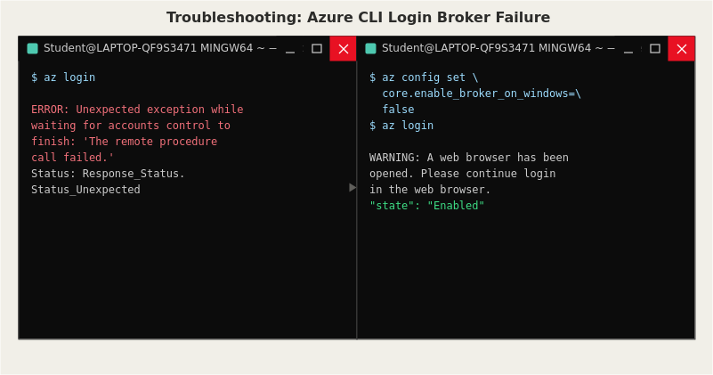

# Issue: Azure CLI Login Failing via Windows Authentication Broker



## Symptom
Running `az login` in Git Bash on Windows failed immediately with:

```
ERROR: Unexpected exception while waiting for accounts control to finish:
'The remote procedure call failed.'. Status: Response_Status.Status_Unexpected
```

Switching to `az login --use-device-code` as a workaround also failed, but with a
different, unrelated error:

```
WARNING: Authentication failed against tenant ... 'Default Directory':
AADSTS530035: Access has been blocked by security defaults.
ERROR: No subscriptions found for [account].
```

## Investigation
The first error pointed to "accounts control," which is part of Windows Account
Manager (WAM) — a newer authentication broker that Azure CLI uses by default on
Windows for interactive sign-in. This broker occasionally fails to communicate
correctly with the OS on certain machine configurations. The second error was
unrelated: it turned out that enabling Security Defaults (for MFA) earlier in the
project intentionally blocks the device code sign-in flow, since that method is a
known phishing vector — this was expected behavior, not a bug.

## Root Cause
Two separate issues stacked on top of each other:
1. The Windows authentication broker (WAM) was failing during standard `az login`.
2. The fallback device-code method was being correctly blocked by the tenant's
   Security Defaults / MFA policy, which does not permit that sign-in method.

## Fix
Disabled the broken Windows broker feature so Azure CLI would fall back to a
standard browser-based sign-in instead:

```bash
az config set core.enable_broker_on_windows=false
az login
```

This opened a normal browser tab, completed MFA correctly, and returned a valid
subscription list — confirming the account was authenticated successfully.

## Prevention
Now that `core.enable_broker_on_windows=false` is set, Azure CLI logins on this
machine consistently use the standard browser flow. This is worth documenting for
any Windows-based cloud engineering setup, since the WAM broker issue is a known,
recurring problem across different Azure CLI versions and Windows builds.
